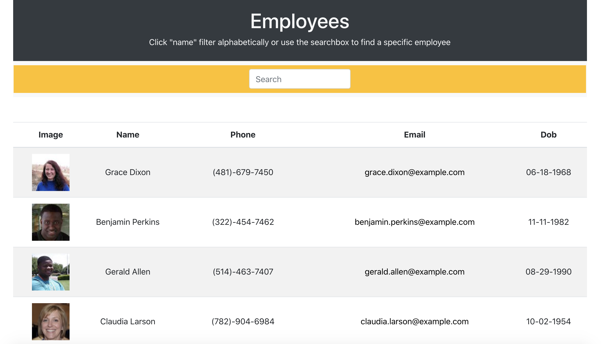
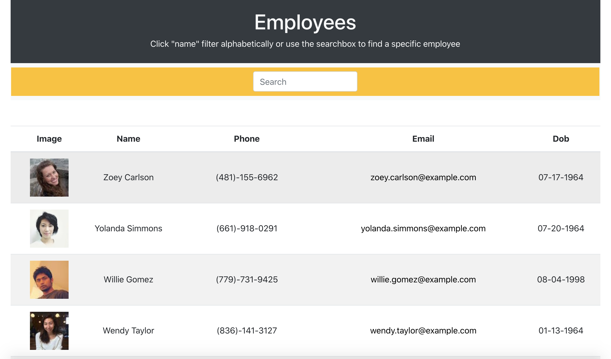
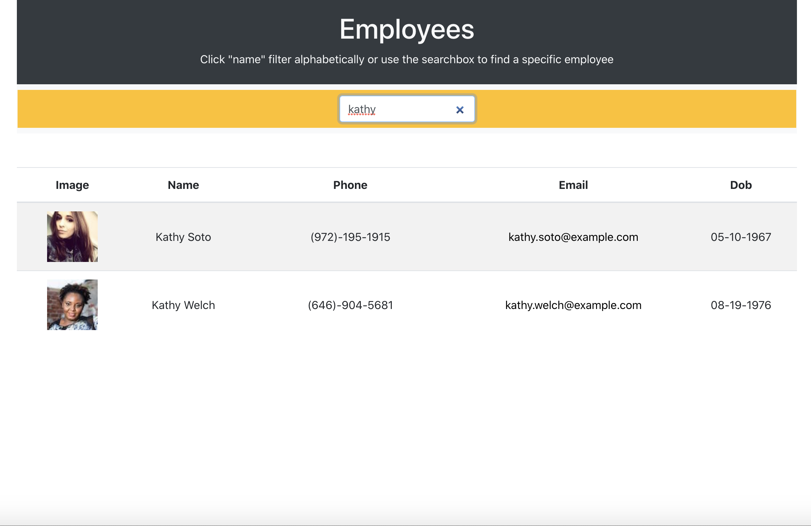

# Employee Directory

 ## Description
 This app is built using [Reactjs](https://reactjs.org/) to display a [list of randomly generated employees](https://randomuser.me/). It allows the user to both sort the employees alphabetically as well as search for a particular employee by using the search box.
  
  ## Link to deployed application

 https://marimartin.github.io/employee-directory/

  ## Screenshot

  